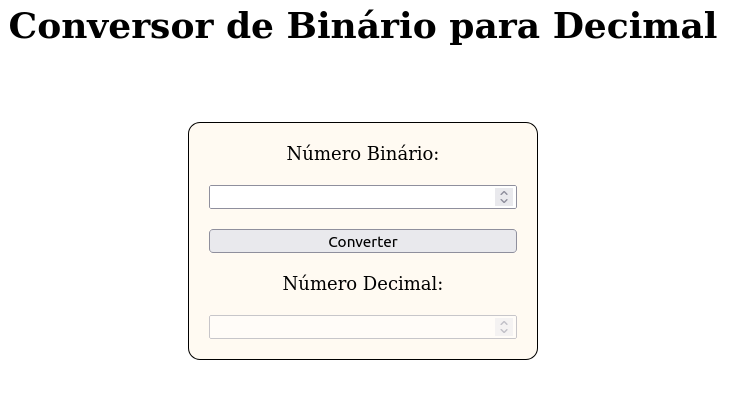

# Conversor Decimal para Binário

Este é um projeto simples de interface que permite aos usuários converter números decimais em números binários. Ele oferece uma maneira fácil e rápida de visualizar representações binárias de números decimais.

## Live Demo

Confira uma demonstração ao vivo do nosso projeto para ver em ação! Você pode acessar a demonstração clicando no link abaixo:

[**Demo ao Vivo**](https://izumi-san.github.io/01-Bin2Dec/)

A demonstração ao vivo permite que você experimente as funcionalidades do projeto sem precisar instalá-lo localmente. Sinta-se à vontade para explorar e testar o projeto no ambiente da demonstração.

## Funcionalidades

- Conversão rápida de números decimais para binários.
- Interface intuitiva e de fácil utilização.
- Saída clara e legível para números binários.

## Como Usar

1. Clone ou faça o download deste repositório para o seu computador.
2. Abra o arquivo `index.html` em um navegador da web.
3. Insira um número decimal na caixa de entrada.
4. Clique no botão "Converter".
5. O número binário correspondente será exibido na área de saída.

